# NewPipe Repository Report

**Scope:** static architecture and code-path review of the local checkout at `C:\Users\Veer\Desktop\personal\Nothing Music\NewPipe`.
**Snapshot:** branch `dev`, commit `7e5df38aad4b2c035332b3f71aee3064d4fdaae4`, dated 2026-09-26. The project version constants identify this snapshot as NewPipe 0.29.1, version code 1015. This report follows the Android app implementation; the repository also contains early shared Compose, desktop, and iOS host code.
**Android build baseline:** compile SDK 37.0, minimum SDK 23 (Android 6.0), target SDK 35, Kotlin/JVM toolchain 21.

## 1. Executive summary

NewPipe is a front end for supported media sites, not a media hosting service. For a selected item, the app asks the NewPipe Extractor library to retrieve metadata and stream descriptions from a service. The extractor returns candidate audio, video, subtitle, and playlist information, including playable URLs. NewPipe then selects a stream and hands it to ExoPlayer for streaming, or to its separate download manager to save it locally.

The app does not normally download a complete file merely to start playback. ExoPlayer makes HTTP requests for the chosen audio/video representation as playback needs data. For audio-only playback, the app usually chooses an audio representation, which is why it can avoid downloading video bytes. If a service exposes no separate audio representation, NewPipe can use a video representation as the audio source.

The Android app runs one shared player in a foreground media service. A MediaSession and player notification expose transport controls to the lock screen, headsets, Android system media controls, and compatible media browsers. Downloads run separately as missions managed by a service. Video downloads that require separate audio and video representations are downloaded as multiple inputs and muxed after transfer.

One important repository boundary: service-specific extraction code is in the separately maintained NewPipeExtractor dependency, not in this NewPipe checkout. This app integrates that library through NewPipe.init, ServiceList, StreamInfo, and extractor helper classes.

## 2. Repository snapshot and structure

| Area | Responsibility in this checkout |
| --- | --- |
| `app/` | Full Android app: browsing, search, player, notifications, settings, Room database, download UI and workers |
| `app/src/main/java/org/schabi/newpipe/player/` | ExoPlayer orchestration, media service, play queues, stream resolvers and player interfaces |
| `app/src/main/java/org/schabi/newpipe/download/` | Android download dialog and download-screen integration |
| `app/src/main/java/us/shandian/giga/` | Embedded download engine, mission persistence, file I/O, notifications and post-processing |
| `app/src/main/java/org/schabi/newpipe/database/` | Room schema and DAOs for subscriptions, feeds, histories, stream state and playlists |
| `shared/` | Kotlin Multiplatform Compose components and shared settings/about/navigation code |
| `desktopApp/` | Desktop Compose launcher for the shared application |
| `iosApp/` | SwiftUI host which embeds a Compose view controller |
| `gradle/` and `buildSrc/` | Version catalog, Android/Kotlin build configuration, SDK and app version constants |

The Android app is still the product described by the README and contains the mature streaming and downloading paths described below. The desktop launcher starts the shared Compose app at its About destination. The SwiftUI host wraps shared Compose UI. These shared/mobile-host modules are not evidence that the Android playback and Giga download implementation has been ported to desktop or iOS.

## 3. Supported services and extraction

The README lists YouTube and YouTube Music, PeerTube instances, Bandcamp, SoundCloud, and media.ccc.de. It says YouTube is the best-supported service and notes that SoundCloud and PeerTube need maintainers. Support and feature depth therefore differ by site.

The README describes the service strategy: use a service's official API where appropriate; where an API is proprietary or too restricted for NewPipe's use, parse the website or use an internal API. The app does not require the user to sign into a service for its normal browsing and playback flow, and the project says it avoids proprietary frameworks such as Google Play Services.

### App initialization and HTTP requests

At application startup, App.kt initializes settings, creates DownloaderImpl, passes it to NewPipe.init with the preferred locale and country, initializes service configuration, and registers a YouTube PO-token provider. ServiceHelper.initServices initializes per-service configuration.

DownloaderImpl is the extractor's HTTP adapter. It executes extractor Request objects with OkHttp, supplies a User-Agent and configured headers, supports Brotli/Gzip compression, carries selected cookies, and translates the result into the Extractor's Response type. Cookie handling here is limited to app-configured values such as reCAPTCHA cookies and YouTube restricted-mode cookies; this is not a general account-login implementation.

Search and item pages are also extractor operations. ExtractorHelper.searchFor builds a service-specific search handler and invokes SearchInfo.getInfo. ExtractorHelper.getStreamInfo invokes StreamInfo.getInfo for the selected service and URL. Those calls are wrapped in RxJava Single objects. The detail screen subscribes on an I/O scheduler, then moves the result to the main thread.

ExtractorHelper caches Info objects in InfoCache, an in-memory LRU capped at 60 items. A forced refresh removes a cached entry before fetching it again. This is metadata caching; it is separate from ExoPlayer's media-byte cache and separate again from downloaded files.

### What StreamInfo represents

For a media item, the extractor's StreamInfo gives the app details such as title, duration, service identity, stream type, candidate AudioStreams, VideoStreams, video-only streams, subtitles, and other metadata. The app uses this information to build a player queue or populate download choices. It does not implement each site's HTML/API parsing itself.

## 4. Audio fetch and playback path

```mermaid
flowchart LR
    A[User selects item] --> B[Detail screen]
    B --> C[ExtractorHelper]
    C --> D[NewPipe Extractor service]
    D --> E[Site API or parsed site response]
    E --> F[StreamInfo: metadata and stream candidates]
    F --> G[MediaSourceManager and resolver]
    G --> H[ExoPlayer DataSource]
    H --> I[Audio/video bytes streamed from service CDN]
    I --> J[PlayerService, notification and MediaSession]
```

### From selected item to a media source

1. The detail screen calls ExtractorHelper.getStreamInfo(serviceId, url, forceLoad). Its Rx chain performs extraction on an I/O scheduler and reports results on the Android main thread.
2. For playback, Player owns a PlayQueue and a MediaSourceManager. The manager fetches each queue item's StreamInfo, passes it to Player.sourceOf, and wraps the resolved media source in managed queue entries. It loads queue sources as needed around the current item.
3. Player.sourceOf chooses AudioPlaybackResolver for the explicit audio player type. For video or popup playback, it chooses VideoPlaybackResolver. There are additional checks to preserve video playback when switching between audio-only/background and video modes.
4. The resolver chooses a candidate representation from the extractor's StreamInfo, applies format and quality preferences, and creates ExoPlayer MediaSource objects through PlaybackResolver.
5. PlayerDataSource supplies ExoPlayer factories for progressive HTTP, DASH, HLS, SmoothStreaming, and subtitle samples. The player reads directly from the stream URLs; NewPipe is not relaying the media through its own server.

For non-YouTube services, PlaybackResolver dispatches according to the stream's delivery method: progressive HTTP, DASH, HLS, or SmoothStreaming. It rejects unsupported delivery types such as torrent input for this ExoPlayer path. YouTube receives special handling: the app uses a custom YouTube HTTP data source and code that builds/parses DASH manifests for some formats. Live streams also have dedicated handling.

PlayerDataSource configures ExoPlayer's network sources and a disk cache under the app's external cache directory. CacheFactory connects cached and upstream reads. This cache is not the same as the user's saved downloads, and cached segments are evictable.

### Separate audio and video representations

Some services expose a combined audio/video representation. Others expose video-only and audio-only representations separately, especially for higher resolutions. In video mode, VideoPlaybackResolver may create one media source for video and another for audio, then combine them with ExoPlayer's MergingMediaSource. It can also attach subtitle sources. In audio mode, AudioPlaybackResolver filters and selects an audio track and constructs a source for that stream.

If the service has no separate AudioStream, AudioPlaybackResolver can choose a playable video stream as the fallback audio source. This means background audio support is not guaranteed to be video-free for every service/format.

### Audio, background, and data usage

The player types are MAIN, AUDIO, and POPUP; background audio is represented by the audio player type, rather than a separate BACKGROUND player type. The background player UI is a nonvisual player component that disables video and text/subtitle track types. This saves network data when the active source has separately selectable tracks.

The detail screen's background-player action routes playback through NavigationHelper to the shared PlayerService. The service creates the Player and sends the play queue as an intent. The player creates an ExoPlayer instance, configures media audio attributes and audio focus, handles noisy audio output, and requests a network wake mode. A lock manager also manages a Wi-Fi lock while needed.

One subtle behavior: when moving from audio/background to video, NewPipe keeps enough information to restore video. For video with separate audio and video tracks, it may keep the video-capable resolver and disable the video renderer while in the background. If the selected source is combined audio/video, the audio resolver can be used instead. For some HLS live streams, ExoPlayer may still request video segments despite disabling the video renderer; the code comments document this exception.

### Queue and track behavior

PlayQueue represents a local sequence or a remote list such as a playlist/channel tab. It tracks the current item and playback recovery position, supports appending, reordering, shuffling and unshuffling, and emits queue events. Playlist/channel queues load their items through extractor paging APIs. MediaSourceManager resolves queue entries and keeps the player supplied with media sources.

Playback choices include preferred video quality and audio track. When audio/video languages or qualities are available separately, the resolver picks an appropriate source according to settings and can merge them for video playback. Stream URLs can expire or become invalid as sites change; the app has source-specific HTTP handling and reload/error paths. The player and downloader should not be treated as permanent URL stores.

## 5. How background music continues

The background audio mechanism consists of several Android pieces working together:

- PlayerService extends AndroidX MediaBrowserServiceCompat. It owns one Player, one MediaSessionCompat, and a MediaSessionConnector.
- The service registers the browser service and media-button action in the manifest. It is therefore addressable by Android media controls and compatible media browsers.
- When NewPipe starts it as a foreground player service, PlayerService.onStartCommand creates the player if needed and asks NotificationPlayerUi to post a player notification and call startForeground.
- MediaSessionPlayerUi publishes session state, metadata, actions, and media-button handling. The notification presents playback controls. This lets the lock screen, Bluetooth/headphone buttons, notification shade, and compatible clients control playback without the app's activity being visible.
- BackgroundPlayerUi calls Player.useVideoAndSubtitles(false) to disable video and text renderers. The audio track and queue continue through the same ExoPlayer session.
- The manifest declares foreground-service and media-playback permissions and marks PlayerService as mediaPlayback. The download service has its own dataSync foreground-service type.

The notification/foreground service gives Android the expected active-media signal and increases the chance playback will continue while the UI is backgrounded. It does not guarantee uninterrupted playback in every circumstance: network changes, battery policies, force-stop, OS restrictions, extractor/site changes, and source expiry can still interrupt it.

## 6. Download workflow

Downloads use a separate implementation from ExoPlayer streaming.

1. A caller supplies a StreamInfo to DownloadDialog. The dialog presents available audio, video, and subtitle streams, lets the user select formats/quality/language, chooses a filename and storage location, and checks whether a mission already targets the same file.
2. The current download UI filters candidate audio, video, and subtitle inputs to PROGRESSIVE_HTTP. The source comments explicitly say the downloader would need adaptation before supporting other delivery methods. A stream being playable does not necessarily mean it is downloadable by this dialog.
3. For audio-only downloads, the selected audio URL becomes a download mission. For a video that uses a separate audio track, the dialog gives both URLs to the mission so they can be assembled after the transfer.
4. DownloadManagerService.startMission packages the URL(s), output URI, media kind, concurrency setting, stream metadata, post-processing name/arguments, and recovery hints into an intent. The service creates a DownloadMission and gives it to DownloadManager.
5. The Giga engine uses HttpURLConnection for media file transfers. It can issue HTTP Range requests and split supported files into blocks handled by worker threads. It reports mission progress to the service/UI and can pause, resume, retry, or cancel missions.
6. After required bytes arrive, post-processing writes the chosen output container/format, then the mission is marked finished and the UI/service updates the download record and notification.

### Formats and post-processing

Audio downloads are direct where possible. The dialog chooses format-aware output naming; for example, WebM Opus can be demuxed into an Ogg/Opus output, and M4A can use the M4A no-DASH postprocessor. For a video download with a separate audio representation, the engine downloads both and uses the MP4-from-DASH or WebM muxer according to format. TTML subtitles can be converted to SRT. These are in-repository post-processors; the Gradle app dependency list does not show an FFmpeg dependency.

### Storage, pause/resume, and recovery

The app supports Android's document/storage URI abstractions through its file helper and storage picker integration. It maintains pending mission metadata in app-private storage and finished download records in its own downloads.db SQLite store. This is distinct from the Room database that stores app history/subscriptions/playlists.

Pause/resume depends on the server supporting byte ranges and on the resource still being recoverable. The engine persists progress metadata and includes recovery hints such as media type, selected format, bitrate/resolution, language, and whether a stream is video-only. If an HTTP 403 indicates that a URL expired, the downloader has a recovery path which can re-extract a suitable stream from the source item when recovery information is available. This cannot guarantee success if the site no longer exposes the same stream or changes its behavior.

## 7. Persistence and other app features

AppDatabase is a Room database at newpipe.db, currently schema version 9. Its entities cover service subscriptions, search history, stream metadata/history/state, local and remote playlists, feeds, feed groups, and feed update state. The database can be exported/imported through the app's backup/restore features. Download missions and downloaded files are handled separately by the Giga downloader.

The app's user-facing features documented in the README include browsing/search for supported services, playlists/channels, local playlists, subscriptions without signing in, channel group feeds and notifications, viewing/searching history, subtitles, live streams, video resolutions up to 4K, popup playback, and downloading available audio/video/subtitles. Exact availability depends on service implementation.

## 8. Main package and dependency inventory

Versions below come from this checkout's Gradle version catalog. Hash versions are commit identifiers, not semantic release numbers.

| Component | Version in checkout | Purpose |
| --- | --- | --- |
| NewPipe Extractor | `13a655fe53e0c3065f88725fc1fb594c3ede0169` | Service-specific search/info/stream extraction; separate upstream project |
| ExoPlayer 2 | `2.19.1` | Android playback engine, media sources, DASH/HLS/SmoothStreaming, cache and UI |
| AndroidX Media | `1.7.1` | Compat media browser/session support |
| OkHttp + Brotli | `5.5.0` for OkHttp | Extractor/app HTTP transport; Brotli/Gzip are configured in the downloader |
| Jsoup | `1.23.1` | HTML parsing support used by app/extractor integration |
| RxJava 3 / RxAndroid | `3.1.12` / `3.0.2` | Asynchronous extraction and reactive app/event flows |
| Room | `2.8.4` | Local app database and RxJava integration |
| WorkManager | `2.11.2` | Deferred/background work such as feed and notification jobs |
| Coil 3 | `3.5.0` | Image loading and networking for Compose/UI |
| Kotlin | `2.4.10` | Kotlin app/shared implementation |
| Coroutines Rx3 bridge | `1.11.0` | Coroutine and RxJava interoperability |
| Kotlin serialization JSON | `1.11.0` | Kotlin serialization |
| NanoJSON | `e9d656ddb49a412a5a0a5d5ef20ca7ef09549996` | JSON utility from TeamNewPipe |
| NoNonsense FilePicker | `5.0.0` | File/directory selection |
| Material Components | `1.11.0` | Android UI components |
| Groupie | `2.10.1` | RecyclerView grouping/layout support |
| Markwon | `4.6.2` | Markdown display |
| ACRA | `5.13.1` | Crash reporting framework |
| PrettyTime | `5.0.8.Final` | Human-readable relative dates |
| Compose Multiplatform | catalog values | Shared About/settings/UI scaffolding for JVM and iOS host |

Other relevant packages include AndroidX AppCompat, Core, Fragment, Lifecycle, Preference, RecyclerView, DocumentFile, Media, Room and Work; RxBinding; Evernote state saving; a process restart helper; and Koin in shared/. Debug builds also declare LeakCanary and Stetho. The dependency inventory is taken from app/build.gradle.kts, shared/build.gradle.kts, desktopApp/build.gradle.kts, and gradle/libs.versions.toml; it is not an enumeration of every transitive dependency.

## 9. Privacy, platform requirements, and operational limits

- The README says the app does not require service accounts for ordinary use and avoids Google Play Services. The app does make network requests to the supported service endpoints and media CDNs to fetch search results, metadata, stream URLs, and media bytes.
- App preferences and local history/subscriptions/playlists are stored on-device. Optional error reporting or user-submitted reports are separate actions described by the project's privacy policy.
- The Android manifest requests Internet/network state and wake-lock permissions, and declares foreground playback/download services. It also has permissions/settings for notifications, popup overlay, and storage behavior.
- This is a front end, not an official client for the content services. Upstream site/API changes, bot checks, regional restrictions, rate limits, expiring URLs, and format changes can break extraction or playback until the extractor/app is updated.
- The README describes YouTube as the best-supported service and says support levels differ among the other services.
- The project is licensed GPL-3.0-or-later. The README carries a warning against publishing NewPipe or a fork on Google Play and notes the NewPipe word mark is protected.

## 10. Useful source map

All links below are pinned to the checkout commit, so they refer to the code reviewed for this report.

- [README: supported services, extraction model, product features, license](https://github.com/TeamNewPipe/NewPipe/blob/7e5df38aad4b2c035332b3f71aee3064d4fdaae4/README.md#L52)
- [App.kt: NewPipe initialization, service initialization, PO-token provider](https://github.com/TeamNewPipe/NewPipe/blob/7e5df38aad4b2c035332b3f71aee3064d4fdaae4/app/src/main/java/org/schabi/newpipe/App.kt#L92)
- [DownloaderImpl.java: OkHttp extractor adapter and cookies](https://github.com/TeamNewPipe/NewPipe/blob/7e5df38aad4b2c035332b3f71aee3064d4fdaae4/app/src/main/java/org/schabi/newpipe/DownloaderImpl.java#L33)
- [ExtractorHelper.java: search, StreamInfo, cache behavior](https://github.com/TeamNewPipe/NewPipe/blob/7e5df38aad4b2c035332b3f71aee3064d4fdaae4/app/src/main/java/org/schabi/newpipe/util/ExtractorHelper.java#L77)
- [VideoDetailFragment.java: asynchronous info loading and background action](https://github.com/TeamNewPipe/NewPipe/blob/7e5df38aad4b2c035332b3f71aee3064d4fdaae4/app/src/main/java/org/schabi/newpipe/fragments/detail/VideoDetailFragment.java#L857)
- [MediaSourceManager.java: resolve queue item to media source](https://github.com/TeamNewPipe/NewPipe/blob/7e5df38aad4b2c035332b3f71aee3064d4fdaae4/app/src/main/java/org/schabi/newpipe/player/playback/MediaSourceManager.java#L422)
- [AudioPlaybackResolver.java: audio selection and fallback](https://github.com/TeamNewPipe/NewPipe/blob/7e5df38aad4b2c035332b3f71aee3064d4fdaae4/app/src/main/java/org/schabi/newpipe/player/resolver/AudioPlaybackResolver.java#L25)
- [VideoPlaybackResolver.java: video/audio merging and subtitle sources](https://github.com/TeamNewPipe/NewPipe/blob/7e5df38aad4b2c035332b3f71aee3064d4fdaae4/app/src/main/java/org/schabi/newpipe/player/resolver/VideoPlaybackResolver.java#L35)
- [PlaybackResolver.java: delivery-method and YouTube media-source handling](https://github.com/TeamNewPipe/NewPipe/blob/7e5df38aad4b2c035332b3f71aee3064d4fdaae4/app/src/main/java/org/schabi/newpipe/player/resolver/PlaybackResolver.java#L196)
- [PlayerDataSource.java: ExoPlayer HTTP factories and cache](https://github.com/TeamNewPipe/NewPipe/blob/7e5df38aad4b2c035332b3f71aee3064d4fdaae4/app/src/main/java/org/schabi/newpipe/player/helper/PlayerDataSource.java#L35)
- [Player.java: ExoPlayer construction, track modes, source selection](https://github.com/TeamNewPipe/NewPipe/blob/7e5df38aad4b2c035332b3f71aee3064d4fdaae4/app/src/main/java/org/schabi/newpipe/player/Player.java#L621)
- [PlayerService.java: foreground media service, session and binder](https://github.com/TeamNewPipe/NewPipe/blob/7e5df38aad4b2c035332b3f71aee3064d4fdaae4/app/src/main/java/org/schabi/newpipe/player/PlayerService.java#L54)
- [BackgroundPlayerUi.java: disabling video and text tracks](https://github.com/TeamNewPipe/NewPipe/blob/7e5df38aad4b2c035332b3f71aee3064d4fdaae4/app/src/main/java/org/schabi/newpipe/player/ui/BackgroundPlayerUi.java#L16)
- [DownloadDialog.java: stream filtering, format selection, mission creation](https://github.com/TeamNewPipe/NewPipe/blob/7e5df38aad4b2c035332b3f71aee3064d4fdaae4/app/src/main/java/org/schabi/newpipe/download/DownloadDialog.java#L163)
- [DownloadManagerService.java: mission intent and service workflow](https://github.com/TeamNewPipe/NewPipe/blob/7e5df38aad4b2c035332b3f71aee3064d4fdaae4/app/src/main/java/us/shandian/giga/service/DownloadManagerService.java#L362)
- [DownloadManager.java: mission persistence and scheduling](https://github.com/TeamNewPipe/NewPipe/blob/7e5df38aad4b2c035332b3f71aee3064d4fdaae4/app/src/main/java/us/shandian/giga/service/DownloadManager.java#L230)
- [DownloadMission.java: range transfers, pause and mission recovery](https://github.com/TeamNewPipe/NewPipe/blob/7e5df38aad4b2c035332b3f71aee3064d4fdaae4/app/src/main/java/us/shandian/giga/get/DownloadMission.java#L217)
- [AppDatabase.kt: Room entities and schema](https://github.com/TeamNewPipe/NewPipe/blob/7e5df38aad4b2c035332b3f71aee3064d4fdaae4/app/src/main/java/org/schabi/newpipe/database/AppDatabase.kt#L36)
- [app/build.gradle.kts: Android dependency groups](https://github.com/TeamNewPipe/NewPipe/blob/7e5df38aad4b2c035332b3f71aee3064d4fdaae4/app/build.gradle.kts#L219)
- [gradle/libs.versions.toml: dependency versions and extractor pin](https://github.com/TeamNewPipe/NewPipe/blob/7e5df38aad4b2c035332b3f71aee3064d4fdaae4/gradle/libs.versions.toml#L7)
- [settings.gradle.kts: included Gradle projects](https://github.com/TeamNewPipe/NewPipe/blob/7e5df38aad4b2c035332b3f71aee3064d4fdaae4/settings.gradle.kts#L8)
- [Shared Compose App.kt](https://github.com/TeamNewPipe/NewPipe/blob/7e5df38aad4b2c035332b3f71aee3064d4fdaae4/shared/src/commonMain/kotlin/net/newpipe/app/App.kt)
- [NewPipe Extractor project](https://github.com/TeamNewPipe/NewPipeExtractor)

## 11. Review notes

This report is based on source and build-file inspection at the commit listed at the top. I did not modify the NewPipe checkout, build the app, or run tests.
